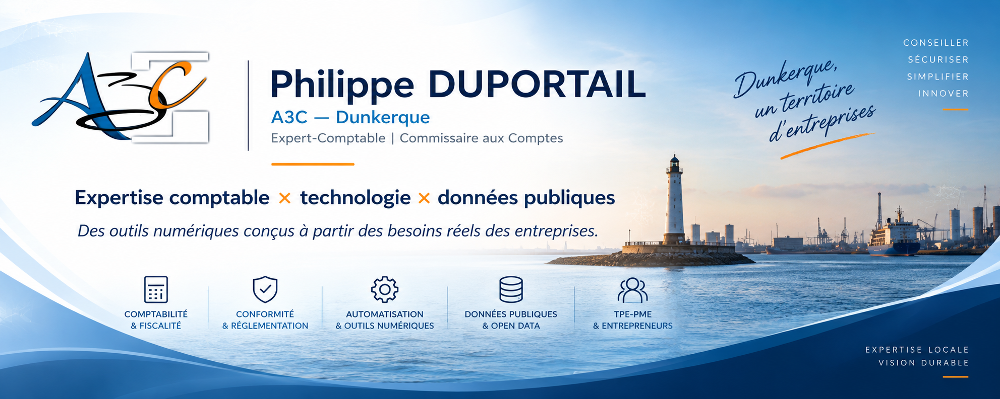

  

---

## 👋 À propos

Je suis **expert-comptable et commissaire aux comptes** au sein du cabinet **A3C à Dunkerque**.

J'utilise GitHub pour publier et documenter des outils numériques développés autour de problématiques rencontrées dans l'accompagnement quotidien des entreprises.

La démarche est volontairement pragmatique :

> **simplifier les contrôles, fiabiliser l'information, documenter les diligences et rendre les outils accessibles aux TPE et PME.**

Les projets publiés ici se situent notamment à la rencontre de la comptabilité, de la fiscalité, du droit social, de la conformité et de l'exploitation des données publiques.

---

## 🧰 Projets A3C

  

<strong>Vérifiez. Identifiez. Documentez.</strong>

Extension Chrome A3C destinée au contrôle et à la documentation des partenaires économiques français et européens.

**VIES • Identité entreprise • EORI • Sources publiques • PDF de diligence • Historique • Recontrôle**

➡️ **[Découvrir le projet et sa documentation](https://github.com/duportailphilippe/A3C-Controle-TVA-UE)**  
⬇️ **[Télécharger la dernière version](https://github.com/duportailphilippe/A3C-Controle-TVA-UE/releases/latest)**

## 🎯 Des outils conçus à partir du terrain

Les projets A3C ne partent pas d'une technologie à laquelle il faudrait trouver une utilisation.

Ils partent d'abord d'une question professionnelle :

**« Comment rendre cette tâche plus simple, plus fiable et mieux documentée ? »**

Les domaines explorés concernent notamment :

`Comptabilité` • `Fiscalité` • `Paie` • `Droit social` • `Conformité` • `Facturation électronique` • `Automatisation` • `Open Data`

---

## 🧭 Principes de conception

### 🎯 Utilité

Une fonctionnalité doit répondre à un besoin professionnel identifiable.

### 🔎 Traçabilité

Lorsque cela est pertinent, l'utilisateur doit pouvoir comprendre les informations utilisées et retrouver leur origine.

### 🏛️ Sources publiques

Les outils privilégient autant que possible les données issues de sources publiques ou officielles.

### 🔐 Protection des données

La collecte et la conservation des données doivent rester proportionnées à la finalité recherchée.

### 🧑‍⚖️ Jugement professionnel

L'automatisation assiste l'utilisateur.

Elle ne doit pas transformer une information imparfaite en certitude ni remplacer l'analyse professionnelle lorsque celle-ci est nécessaire.

---

## 🚧 Projets et expérimentations

Ce compte GitHub a vocation à accueillir progressivement d'autres outils A3C consacrés notamment à :

* la gestion et au contrôle des temps de travail ;
* la collecte des variables de paie ;
* la simplification de formalités administratives ;
* la fiscalité ;
* la facturation électronique ;
* l'exploitation de données publiques ;
* la production de documents de contrôle et de diligence ;
* l'automatisation de tâches destinées aux TPE et PME.

Certains projets peuvent rester expérimentaux avant leur publication.

---

## 🏢 A3C

**Expertise comptable • Commissariat aux comptes**

📍 Dunkerque — France
🌐 [www.a3c.fr](https://www.a3c.fr/)
💼 [LinkedIn — A3C](https://www.linkedin.com/company/a3c/)
📝 [Blog de l'Expert-Comptable](https://lexpertcomptable.blogspot.com/)

---

## ⚠️ À propos des outils publiés

Les logiciels, simulateurs, extensions et ressources publiés sur ce compte sont des **outils d'assistance**.

Ils peuvent faciliter des contrôles, calculs, recherches ou diligences, mais ne se substituent pas :

* aux textes légaux et réglementaires applicables ;
* aux sources administratives officielles lorsqu'une consultation directe est requise ;
* à l'analyse des circonstances particulières d'une situation ;
* au jugement professionnel de l'utilisateur.

Les fonctionnalités et sources disponibles peuvent évoluer.

---

### A3C — des outils professionnels conçus à partir de besoins professionnels.

**Dunkerque 🇫🇷**

